# Proses 3D Design
Pada 3D Design ini menggunakan aplikasi Blender 3D Design, desain dengan menambahkan objek dan menyesuaikan ukuran dimensi Arduino ATMega 2560 dan komponen lain seperti push button dan port female audio.
<br>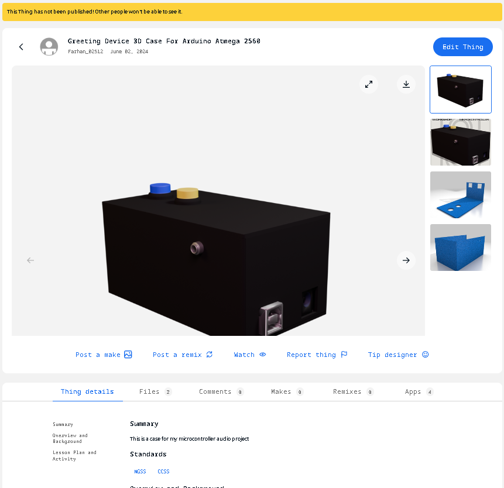
# Proses 3D Print
Sesi 3D printer dilakukan dengan mengubah file desain kedalam bentuk ```stl``` yang kemudian dibuah kedalam bahasa mesin ```G code``` untuk dimasukkan kedalam memori card yang kemudian diinputkan kedalam mesin 3D Print.

## Convert STL ke Gcode dengan Creality Ender 3pro
Untuk desain model menggunakan `Autodesk inventor` lalu disimpan dengan format stl : [Desain STL](Desain_stl.rar)

Selanjutnya software `ultimaker cura` digunakan untuk setting dan juga merubah desain stl ke bahasa mesin (3d print) dengan langkah berikut.
1. Open file desain inventor (format stl).Berikut untuk tampilan software ultimaker cura:
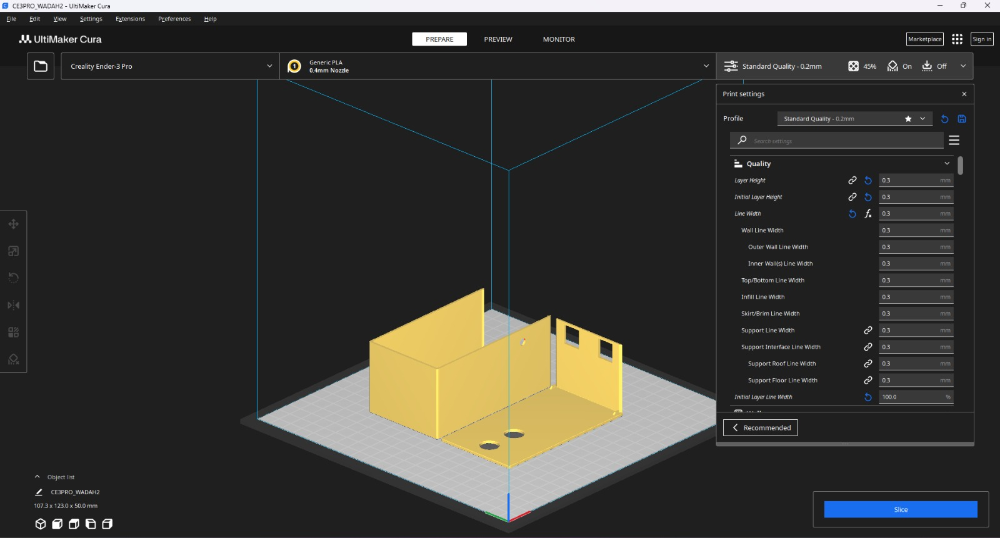
2. Pilih 3d print yang kita gunakan misal `creality ender 3pro`, lalu sesuaikan atau setting desain tersebut misal untuk dinding pada hasil 3d print kita atur di bagian Quality, Walls, Top/Bottom, Infill : 
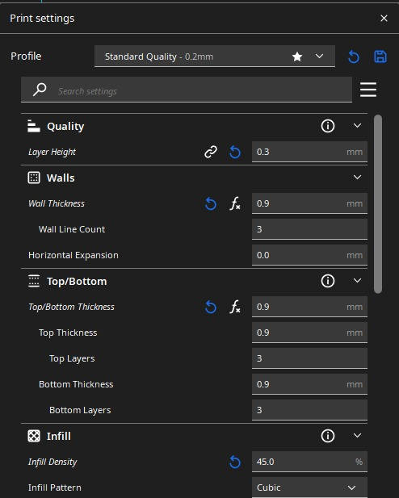<br>
Selanjutnya pada bagian Material, Speed, Travel, dan Cooling kita atur sebagai berikut : 
<br>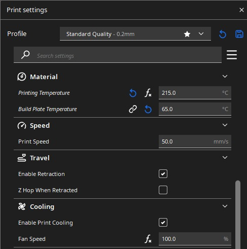<br>
Kemudian kita atur pada bagian Support dan Build Plate Adhesion:
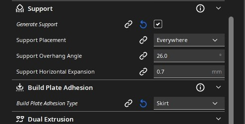

4.	Setelah selesai kita simpan desain kita ke sd card. Untuk penamaan sesuai keinginan misal [Wadah Gcode](Desain-Gcode.rar)

##	Cetak 3D Print

1.	Nyalakan 3d print.
<br>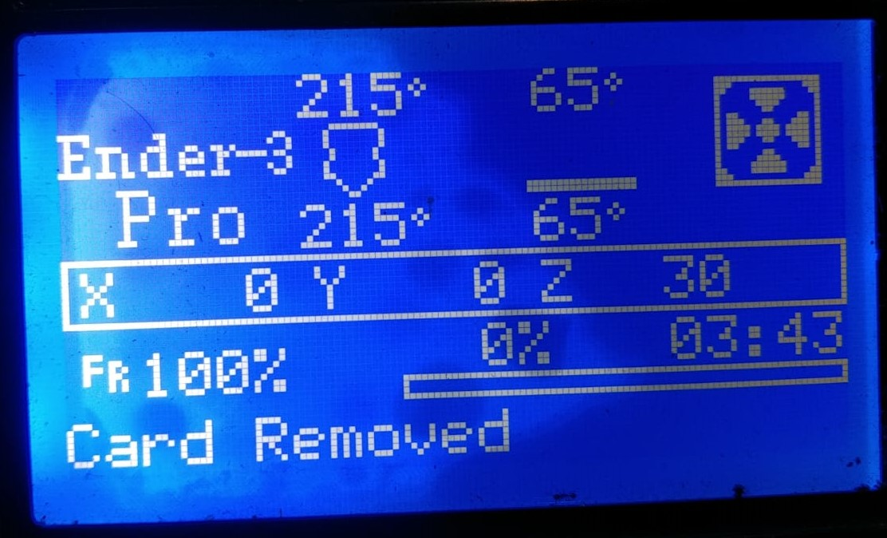
2.	Apabila filament belum terpasang maka panas kan `nozzle` sesuai titik leleh filament tersebut, misal kita menggunakan `pla+` sekitar 210-220 derajat Celcius.
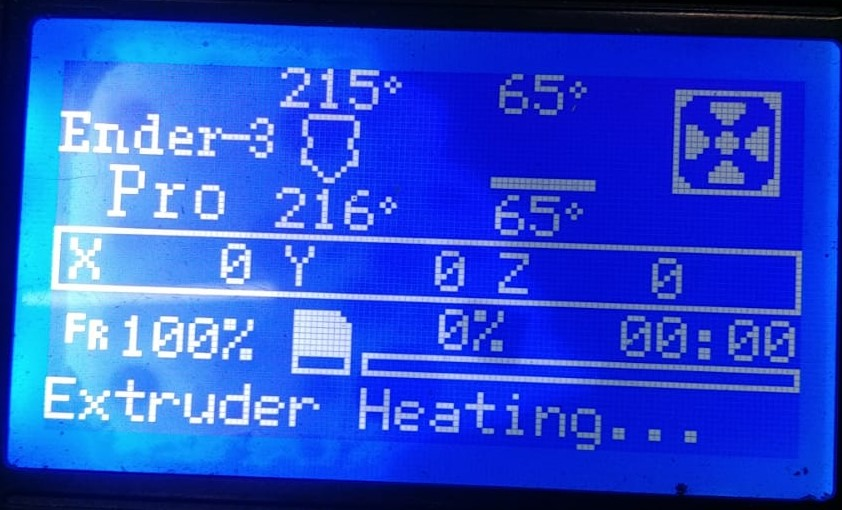
3.	Kita tunggu `nozzle` mencapai panas yang kita inginkan. Jika panas sudah tercapai kita masukan filament melalui `extruder` sampai filament tersebut keluar melalui `nozzle`.
4.	Masukan `sd card` ke tempat yang telah tersedia di 3d print.
5.	Selanjutnya kita impor atau pilih file yang telah kita simpan tadi (Wadah2)
6.	3d print akan mulai `homing`(kalibrasi) dan menyiapkan suhu `bed` dan `nozzle` sesuai yang kita setting di `ultimaker cura` tadi.
7.	Untuk permulaan saya menggunakan kecepatan 80% untuk melihat apakah hasil pada layer pertama bagus atau tidak karena layer pertama akan mempengaruhi layer-layer berikutnya dan hasil 3d print tersebut.
<br>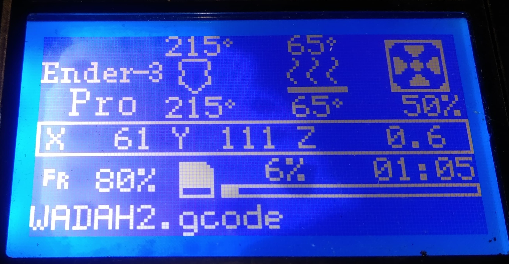<br>
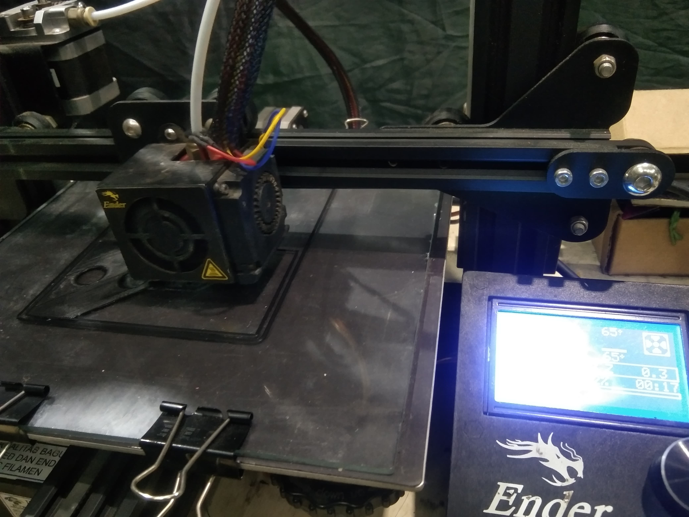
8.	Jika layer pertama sudah selesai atau dirasa sudah bagus naikan kecepatan ke 100% agar cepat selesai.
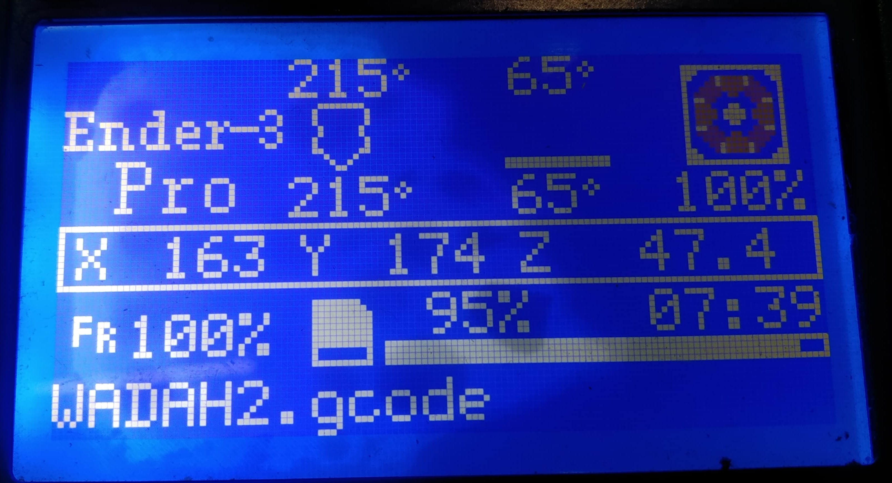
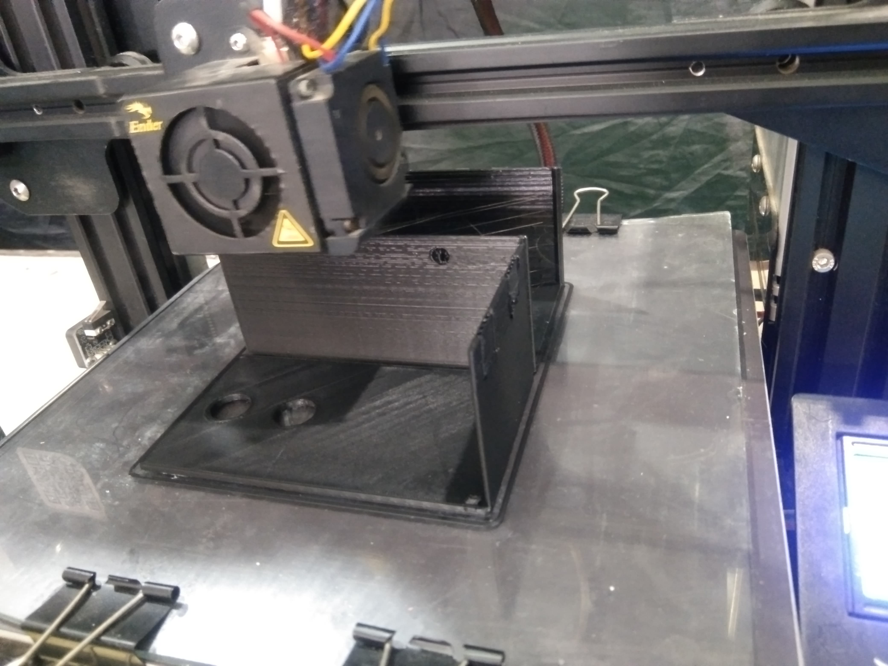
9.	Hasil akhir
<br>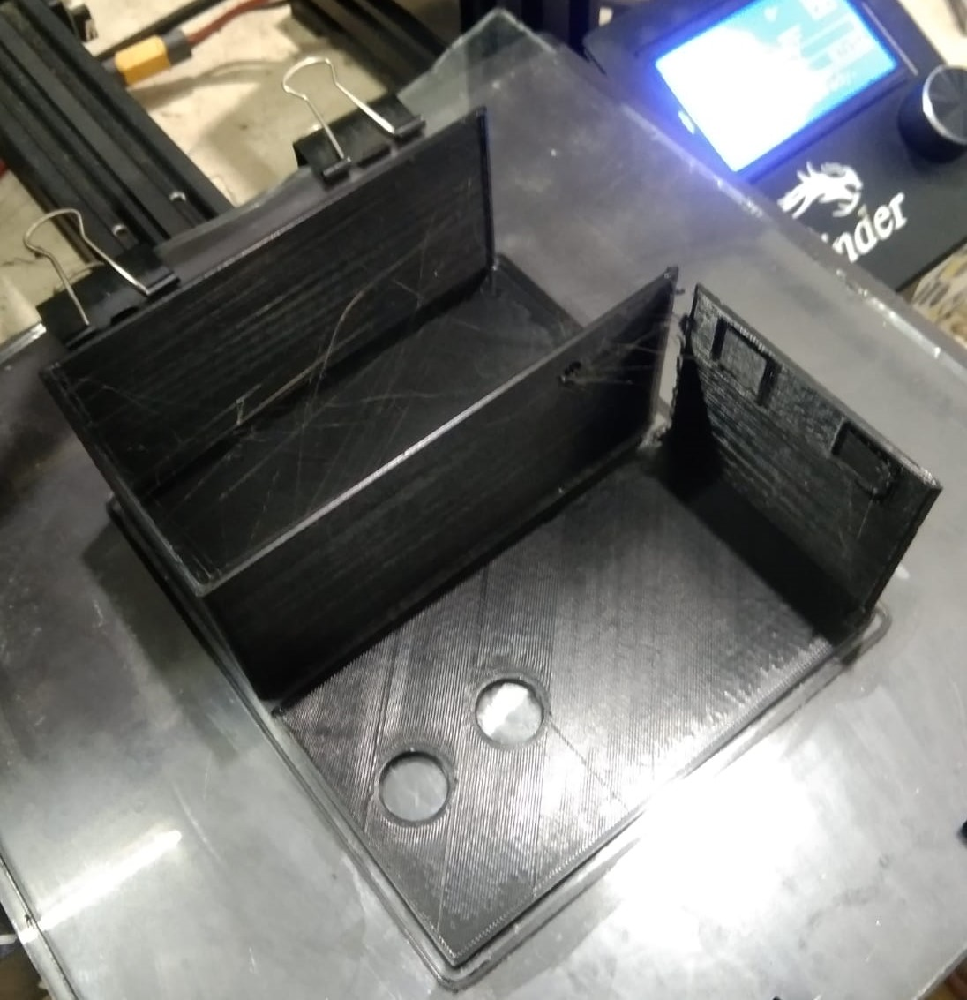
