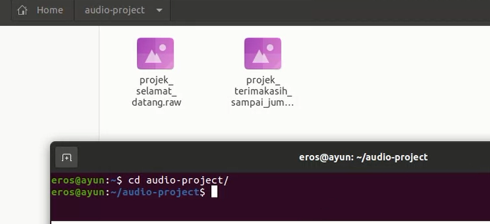
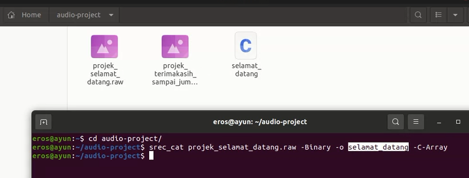
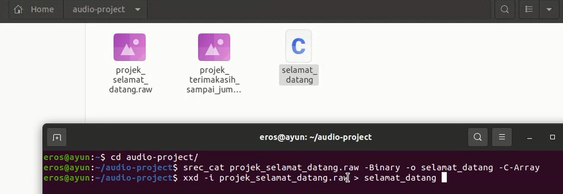

# Struktur Direktori Audio

Direktori ini berisi beberapa jenis file audio yang dibagi ke dalam tiga kategori: MP3, Raw, dan Hex.

## MP3 Files

Dalam kategori ini, terdapat beberapa file dalam format MP3 yang dapat diakses:

- [MP3 Selamat Datang](img/Audacity_Selamat-datang.jpg)
- [MP3 Terimakasih](img/Audacity_Terimakasih.jpg)

## Raw Files

File-file dalam format RAW kami berikan dalam file [Audio RAW](Audio_RAW.zip).

## Hex Files

Di sini, terdapat file-file dengan ekstensi `.unknown` yang mungkin berisi data audio dalam format heksadesimal:

- [RAW Selamat Datang](selamat_datang.unknown)
- [RAW Terimakasih](terimakasih.unknown)

Silakan merujuk ke masing-masing kategori untuk informasi lebih lanjut tentang file-file audio tersebut.

## Tutorial
-  Cara untuk mengatur sample rate:
1. Klik edit
2. Klik Preference
3. Ubah sample rate menjadi '8000 Hz'  

- Cara menyimpan audio dengan format file `raw`
1. Klik File
2. Klik Export Audio
3. Pilih Export to Computer
4. Pada format pilih `Other uncompressed files`
5. Pada header pilih `RAW (header-less)`
6. Pada encoding pilih `Signed 8-bit PCM`
7. Terakhir klik `export`

- Cara konversi file `raw` ke `hex`
1. Buka OS `Ubuntu`
2. Buka folder directori tempat penyimpanan file raw pada `terminal` 

3. Jalankan command `srec_cat file.raw -Binary -o new_file_name -C-Array`

setelahnya akan muncul file baru dengan nama 'new_file_name' yang kita ganti
4. Jalankan command
`xxd -i file.raw > new_file_name.h`  

5. Setelahnya file 'new_file_name' yang telah dibuat sebelumnya akan diubah menjadi file Hex.