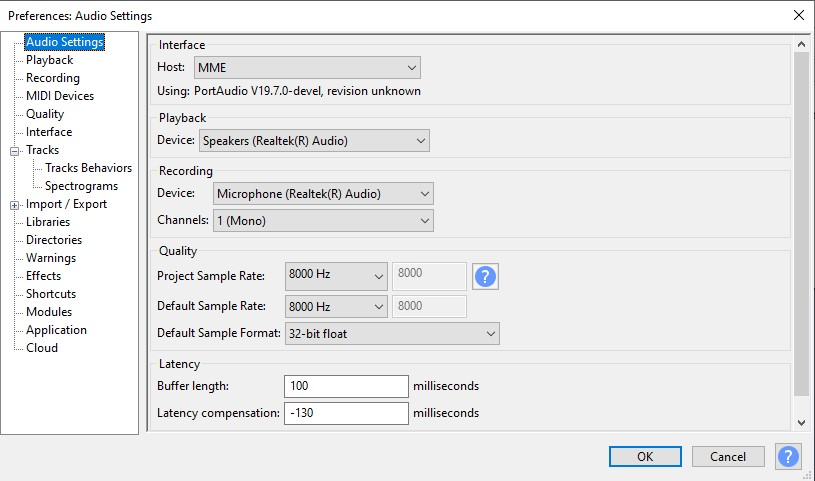

# Struktur Direktori Audio

Direktori ini berisi beberapa jenis file audio yang dibagi ke dalam tiga kategori: MP3, Raw, dan Hex.

## MP3 Files

Dalam kategori ini, terdapat beberapa file dalam format MP3 yang dapat diakses:

- [MP3 Selamat Datang](img/Audacity_Selamat-datang.jpg)
- [MP3 Terimakasih](img/Audacity_Terimakasih.jpg)

## Raw Files

File-file dalam format RAW kami berikan dalam file [Audio RAW](Audio_RAW.zip).

## Hex Files

Di sini, terdapat file-file dengan ekstensi `.unknown` yang mungkin berisi data audio dalam format heksadesimal:

- [RAW Selamat Datang](selamat_datang.unknown)
- [RAW Terimakasih](terimakasih.unknown)

Silakan merujuk ke masing-masing kategori untuk informasi lebih lanjut tentang file-file audio tersebut.

## Tutorial
a. Cara untuk mengatur sample rate:
1. Klik edit
2. Klik Preference
3. Ubah sample rate menjadi '8000 Hz' <br>


b. Cara menyimpan audio dengan format file ```raw```
1. Klik File
2. Klik Export Audio
3. Pilih Export to Computer
4. Pada format pilih 'Other uncompressed files'
5. Pada header pilih 'RAW (header-less)
6. Pada encoding pilih 'Signed 8-bit PCM'
7. Terakhir klik export

