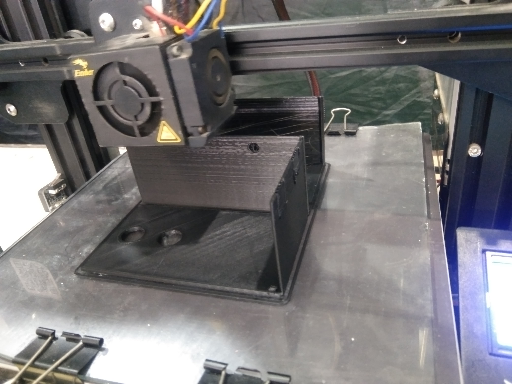

## Proses 3D Print
Sesi 3D printer dilakukan dengan mengubah file desain kedalam bentuk ```stl``` yang kemudian dibuah kedalam bahasa mesin ```G code``` untuk dimasukkan kedalam memori card yang kemudian diinputkan kedalam mesin 3D Print.

## Tutorial 3D Print with Creality Ender 3pro
1. Untuk desain model menggunakan Autodesk inventor lalu disimpan dengan format stl : [Desain STL](Desain_stl.rar)
2.	Selanjutnya menggunakan software ultimaker cura untuk setting dan juga merubah ke bahasa mesin (3d print). Open file desain inventor (format stl).Berikut untuk tampilan software ultimaker cura:

3.	Pilih 3d print yang kita gunakan misal creality ender 3pro, lalu sesuaikan atau setting desain tersebut misal untuk dinding pada hasil 3d print kita atur di bagian Quality, Walls, Top/Bottom, Infill : 

Selanjutnya pada bagian Material, Speed, Travel, dan Cooling kita atur sebagai berikut : 

Kemudian kita aturpada bagian Support dan Build Plate Adhesion:


4.	Setelah selesai kita simpan desain kita ke sd card. Untuk penamaan sesuai keinginan misal [Wadah Gcode](Desain-Gcode.rar)

##	Ke 3D Print

1.	Nyalakan 3d print.

2.	Apabila filament belum terpasang maka panas kan nozzle sesuai titik leleh filament tersebut, misal kita menggunakan pla+ sekitar 210-220 derajat Celcius.

3.	Kita tunggu nozzle mencapai panas yang kita inginkan. Jika panas sudah tercapai kita masukan filament melalui extruder sampai filament tersebut keluar melalui nozzle.
4.	Masukan sd card ke tempat yang telah tersedia di 3d print.
5.	Selanjutnya kita impor file yang telah kita simpan tadi (Mbk ayun)
6.	3d print akan mulai homing(kalibrasi) dan menyiapkan suhu bed dan nozzle sesuai yang kita setting di ultimaker cura tadi.
7.	Untuk permulaan saya menggunakan kecepatan 80% untuk melihat apakah hasil pada layer pertama bagus atau tidak karena layer pertama akan mempengaruhi layer layer berikutnya dan hasil 3d print tersebut.


8.	Jika layer pertama sudah selesai atau dirasa sudah bagus naikan kecepatan ke 100% agar cepat selesai.


9.	Hasil akhir

