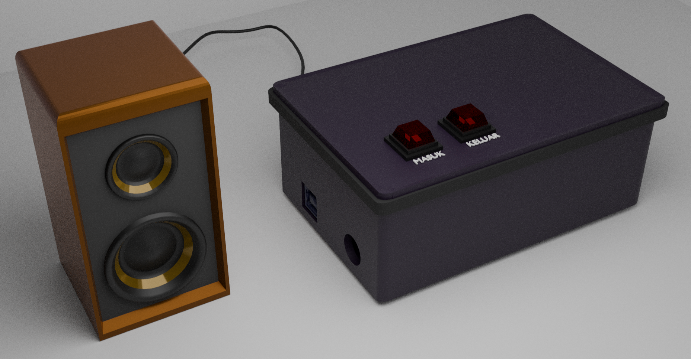

# Audio-Digital-Project

>This project is to make an audio recording which is then stored in the ATMEGA 2560 EEPROM and converted into a PWM signal then the audio output is output to the active speaker.

---
### Komponen
1. Arduino Mega2560
2. Push Button
3. Speaker Mono
--- 

### [Desain](https://github.com/HaqifalHS/Audio-Digital-Project/blob/e685f46bf5777b190d26c859aad1c4a9765173e5/Mekanik/Readme.md)
- Desan Mekanik 3D<br>
  
- Desain Schematic<br>
  
---

### Audio
File audio dari mp3 akan dikonversi menjadi file hex dengan urutan file ```mp3``` > ```raw``` > ```hex```.

Selanjutnya konversi file raw ke hex melalui terminal ubuntu dengan command berikut : <br>
```srec_cat file.raw -Binary -o new_file_name -C-Array```<br>
```xxd -i file.raw > new_file_name.h``` <br>

---
### Program
Program dibuat menggunakan platfromio.h dengan framework Arduino. Dimana program menggunakan bahasa cpp dengan berisikan kontrol PWM dan button, file ```hex``` dari audio dikonfigurasikan menjadi library

---
