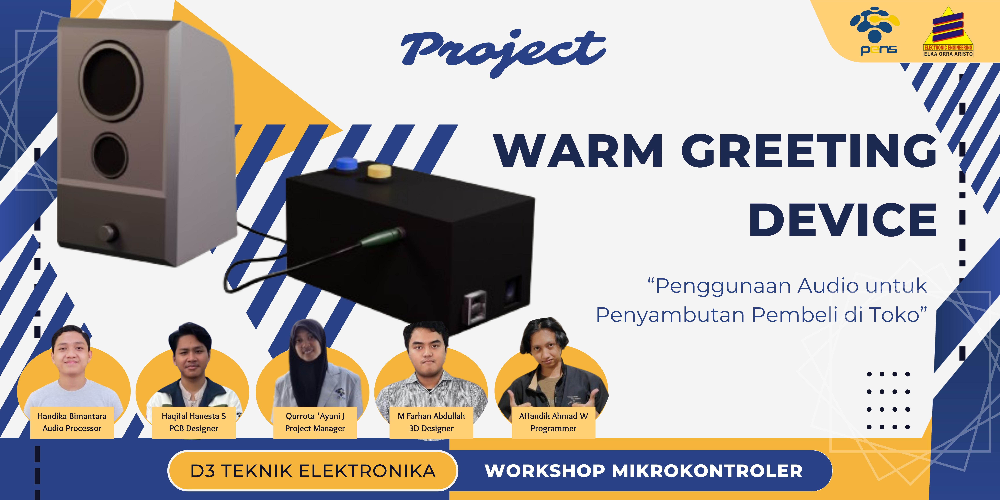
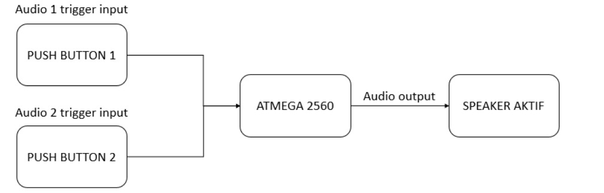
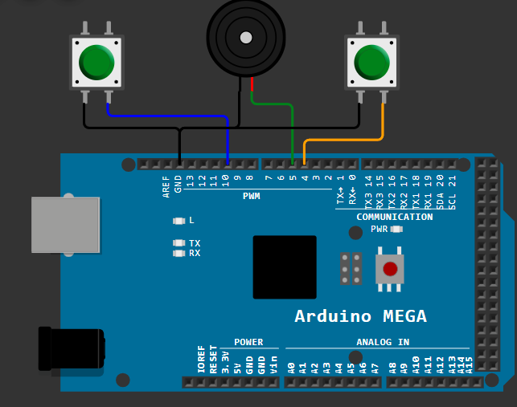
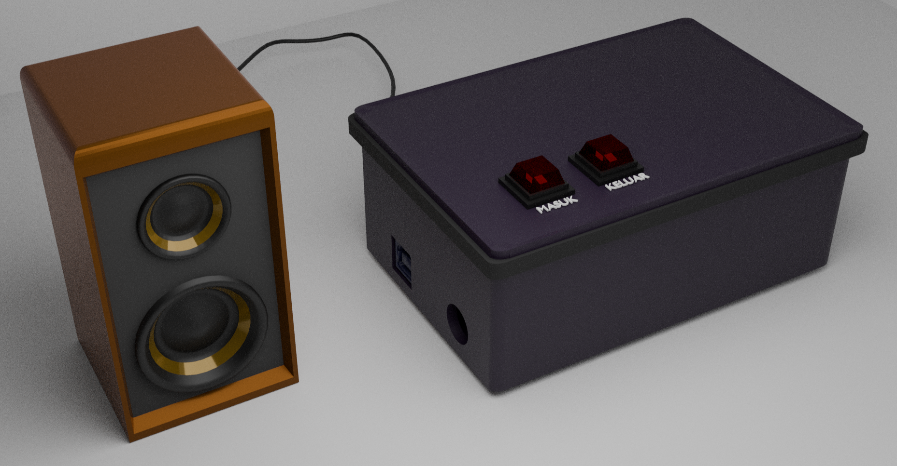
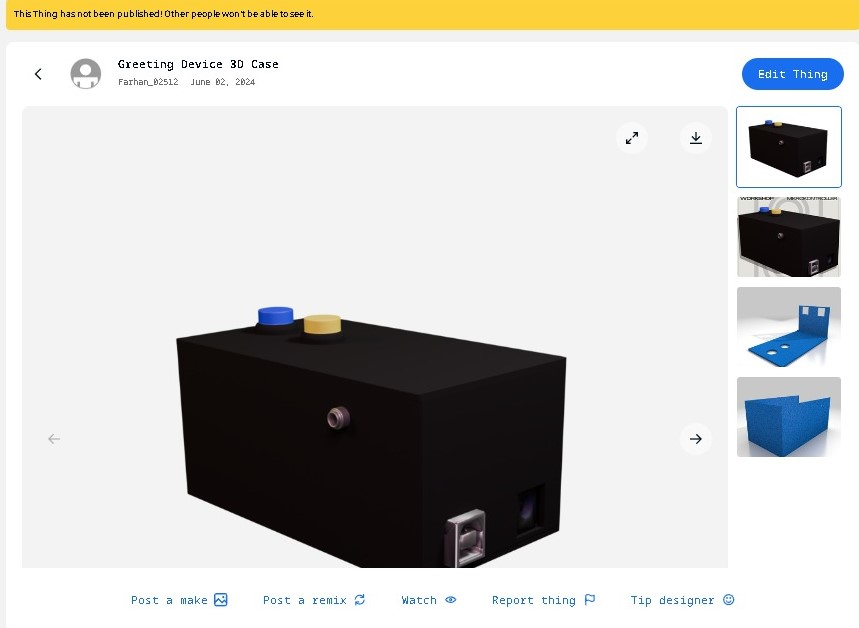
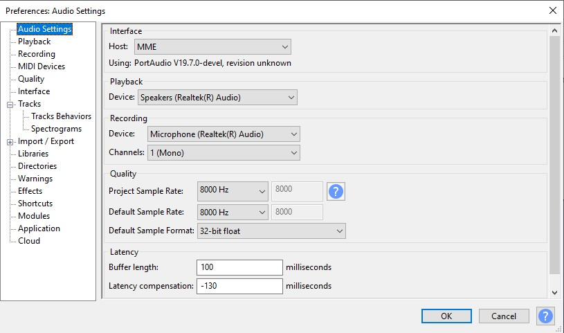

# Warm Greeting Device
## Audio-Digital-Project

    Project ini berkerja untuk membuat rekaman audio yang akan disimpan pada EEPROM Arduino Mega 2560 yang diubah menjadi sinyal PWM. `Warm Greeting Device` dibuat untuk membantu penjual untuk menyambut pembeli sebagai daya tarik pembeli.
    
    Sistem berjalan apablia Push Button 1 ditekan maka akan menulis data pada EEPROM yang berupa input audio `Selamat Datang` ke pada pembeli yang datang ke Toko. 
    
    Sedangkan ketika Push Button 2 ditekan maka akan menulis data pada EEPROM yang berupa input audio `Terimakasih` ke pada pembeli yang meninggalkan Toko. 
    
    Output sistem akan berupa audio yang dijalankan pada speaker aktif.
---

### Support By :
>- Dosen Pengampu : Akhmad Hendriawan ST., MT. (NIP.197501272002121003)
>- Mata kuliah : Workshop Mikrokontroller
>- Program Studi : D3 Teknik Elektronika
>- Politeknik Elektronika Negeri Surabaya 

### Team Member :
|      NRP      |       Nama      |    Jobdesk    |   Akun |
| :-----------:|:----------------:| :------------:| :-----:|
| 2122500001    | Haqifal Hanesta Saidya | Hardware Developer       | [@HaqifalHS](https://github.com/HaqifalHS)
| 2122500009    | Qurrota A'yuni Jumayanti        |   Project Manager | [@QrtYuni](https://github.com/QrtYuni)
| 2122500013    | Affandik Ahmad Wicaksono        |    Programmer      | [@cleamen](https://github.com/cleamen)
| 2122500021    | Handika Bimantara               | Audio Processor | [@HanBim](https://github.com/hanbima21)
| 2122500025    | M. Farhan Abdullah              | 3D Designer     | [@025Farhan](https://github.com/025Farhan)

  
<strong><h2>Daftar Isi</h2></strong>

  <ul>
    <li><a href="#warm-greeting-device">Deskripsi Project</a></li>
    <li><a href="#support-by">Support</a></li>
    <li><a href="#team-member">Team Member</a></li>
    <li><a href="#daftar-isi">Daftar Isi</a></li>
    <li><a href="#komponen">Komponen</a></li>
    <li><a href="#schematic">Schematic</a></li>
    <li><a href="#desain-3d">3D Desain</a></li>
    <li><a href="#audio">Audio</a></li>
    <li><a href="#program">Program</a></li>
  </ul>

  </ul>

### Komponen
1. Arduino Mega2560
2. Shield PCB
3. Push Button (2)
4. Speaker Mono
--- 
### [Schematic](Schematic/Readme.md)
Hardware Sistem berjalan berdasarkan blok diagram berikut. 
 
- [Desain Schematic](Schematic/Schematic.pdf) 
  

---
### [Desain 3D](3D/Readme.md)
Desain sistem keseluruhan dalam segi 3D ditampilkan sebagai berikut.
- Desain Mekanik 3D 
   
Untuk Shield Arduino dan PCB didesain seperti ini.
- [Desan Shield](3D/Desain_stl.rar) 

---

### [Audio](Audio/Readme.md)
File audio dari mp3 akan dikonversi menjadi file hex dengan urutan file `mp3` > `raw` > `hex`.

Selanjutnya konversi file raw ke hex melalui terminal ubuntu dengan command berikut :  
`srec_cat file.raw -Binary -o new_file_name -C-Array` 
`xxd -i file.raw > new_file_name.h`  

Berikut ini cara mengonversi `mp3` to `hex`  

https://github.com/HaqifalHS/Audio-Digital-Project/assets/161258021/f7ce8587-4347-4032-91a0-f2add8da7c45

  

---
### [Program](Program/main.cpp)
Program dibuat menggunakan Platfrom.io dengan framework Arduino. Dimana program menggunakan bahasa `AVR` dengan berisikan kontrol PWM dan button, file `hex` dari audio dikonfigurasikan menjadi library, dan main program akan mengakses library tersebut sebagai input yang akan ditulis pada EEPROM

---
