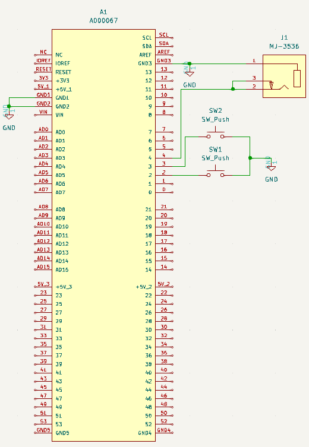
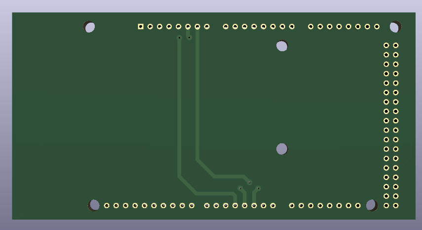
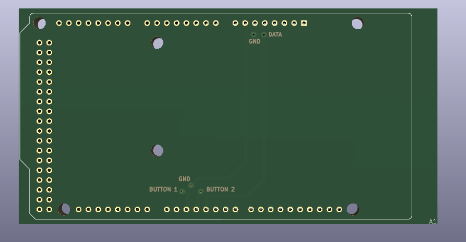
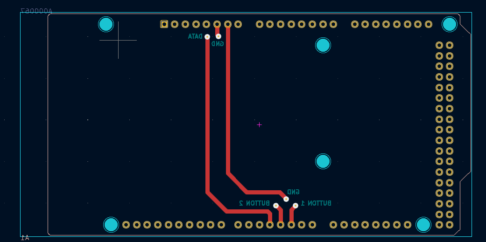

# Desain Schematic
Desain schematic dibuat menggunakan software ```kicad``` dengan langkah-langkah sebagai berikut :

1. Klik ```file->new project```.
2. Beri nama project dengan ```skematik_audio``` atau terserah kita, kemudian simpan di folder yang kita inginkan. Selanjutnya klik ```ok```.
3. Kemudian klik 2 kali pada file kicad_sch di project file untuk membuat schematic-nya.
4. Lalu untuk menambahkan komponen pilih ```add symbol``` dan cari komponen yang kita inginkan.
5. Untuk melakukan rooting rangkaian pilih pada ```add a wire``` kemudian sambungkan antar rangkaiannya. Hasil akhir rangkaian berupa
[Desain Skematik](Schematic.pdf) berikut.

6. Ketika rangkaian sudah jadi klik ```tools->switch to PCB editor``` untuk mulai merangkai pada layer board nya. Pada bagian Button kita rangkai jalur antar komponenya sebagai berikut.
 
Kemudian pada bagian Top kita berikan keterangan jalur komponennya.
 
Sehingga didapatkan hasil akhir [Board](Board.pdf) sebagai berikut.
 
7. Dan ketika pada schematic ada perubahan, pada PCB editor klik ```tools->update PCB from schematic``` untuk melakukan perubahan di bagian rangkaian schematic-nya dan untuk meng-update PCB dari schematic yang diubah.

## Hasil Akhir Schematic

- File Project dari keseluruhan desain dapat di akses pada [Project](Shield_arduino_mega.kicad_pro)
- File Board pada desain schematic dapat di akses pada [File Brd](Shield_arduino_mega.kicad_pcb)
- File Rangkaian Schematic pada desain dapat di akses pada [File Sch](Shield_arduino_mega.kicad_sch)<br>

Untuk hasil cetak PCB sebagai berikut : 
- PCB Top<br>

- PCB Button <br>
